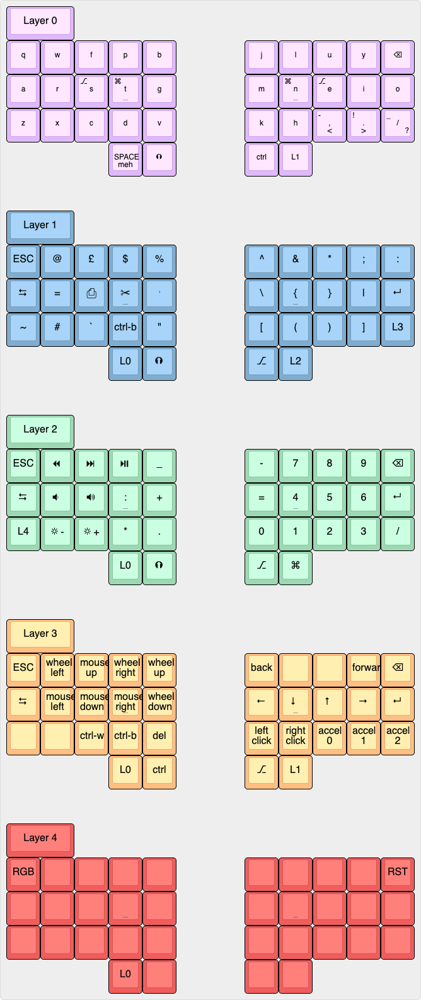

= Keyboard Layout Cheatsheet

== Keymap

== Useful Shortcuts

|===
|Name |Layer |Keys to layer |shortcut (in colemak-dh terms) |config

|tmux move pane
|3
|R2, /
|d, [mnei]
|`bind -n M-[Left,Down,Up,Right] select-pane -[L,D,U,R]`

|tmux resize pane
|3
|R2, /
|R1, [mnei]
|`bind -n M-[Left,Down,Up,Right] resize-pane -[L,D,U,R]`

|tmux split window vertical
|1
|R2
|d, b
|`bind % split-window -h -c "#{pane_current_path}"`

|tmux split window vertical
|1
|R2
|d, v
|`bind '"' split-window -c "#{pane_current_path}"`

|vim move pane
|3
|R2, /
|c, [mnei]
|default behaviour

|vim resize pane
|3
|R2, /
|L1, [mnei]
|`noremap <silent> <C-[Left,Down,Up,Right]> :[ vertical ] resize [+,-]3<CR>`

|change workspace
|
|
|
|

|move window to workspace
|
|
|
|

|next / prev workspace
|
|
|
|

|
|
|
|
|

|
|
|
|
|

|
|
|
|
|

|===
